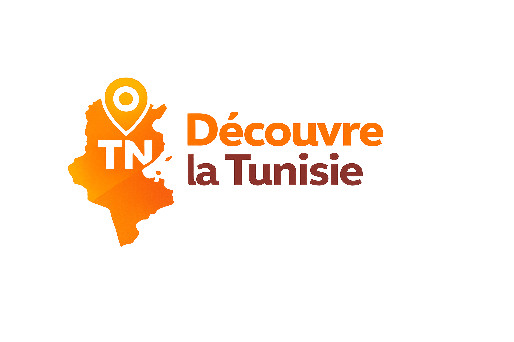

  

<h1 align="center">🇹🇳 TN – Découvre la Tunisie</h1>

  Plateforme web interactive pour explorer les 24 régions tunisiennes

---

##  Présentation du projet

**TN – Découvre la Tunisie** est une plateforme web interactive dédiée à la
découverte du patrimoine tunisien à travers une carte dynamique.

Elle permet aux utilisateurs d’explorer facilement les différentes régions,
d’obtenir des informations détaillées et de sauvegarder leurs préférences.

Le projet met l’accent sur l’ergonomie, l’accessibilité et l’expérience utilisateur.

---

##  Objectifs du projet

- Valoriser le patrimoine tunisien  
- Faciliter l’exploration des régions  
- Proposer une interface moderne  
- Améliorer l’expérience utilisateur  
- Développer un site interactif  

---

##  Fonctionnalités principales

-  Carte interactive SVG de la Tunisie  
-  Barre de recherche par région  
-  Mode sombre / clair  
-  Système de favoris  
-  Fonction de partage  
-  Fiches descriptives détaillées  

---

## Aperçu de l’interface

### 🌞 Mode Clair

  

### 🌙 Mode Sombre

  

---

##  Contenu des fiches régions

Lorsqu’une région est sélectionnée, une fiche s’affiche avec :

- Nom de la région  
- Image représentative  
- Description informative  
- Boutons favoris & partage  

---

##  Technologies utilisées

- HTML  
- CSS  
- JavaScript  
- SVG (Carte interactive)  
- Responsive Design  

---

